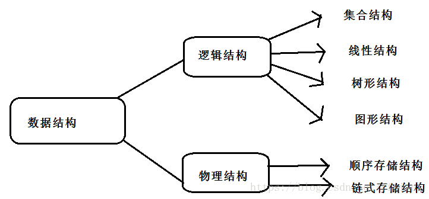

# 数据结构的基本概念
数据：描述客观事实的符号，是计算机中可以操作的对象，能被计算机识别，并输给计算机处理的符号集合。
数据元素：是组成数据的、有一定意义的基本单位，在计算机中通常作为整体处理，也被成为记录。、
数据对象：是性质相同数据元素的集合，是数据的一个子集
数据项：一个数据元素可以由若干个数据项组成，数据项是数据不可分割的最小单位。
数据结构：相互之间存在一种或者多种特定关系的数据元素的集合。可分为逻辑结构和物理结构。

