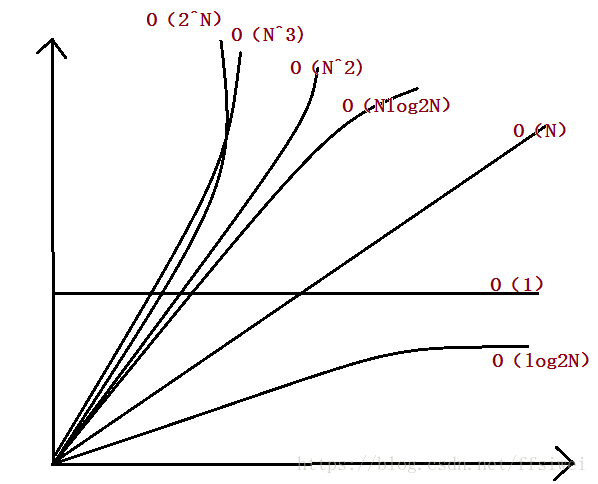

# 算法概念

算法：解决特定问题的步骤的描述

1. 特性：

- 输入：有零个输入或者多个输
- 输出：只有一个或者多个输出
- 有穷型性：算法在执行有限 个步骤时，会自动结束而不会陷入无限循环里面
- 确定性：算法的每一步都有确定的含义而不会出现二义性
- 可行性：算法的每一步都可以通过有限次数完成。

2. 要求：
   正确性、可读性、健壮性、时间效率高而且空间使用率低、简单性。

# 时间复杂度

时间复杂度实际上是一个函数，代表基本操作重复执行的次数，进而分析函数虽变量的变化来确定数量级，数量级用O表示，所以算法的时间复杂度为：`T（n）=O（f（n））；`

在一个算法存在最好、平均、最坏三种情况，我们一般关注的是最坏情况，原因是，最坏情况是任何输入实例在运行时间的上界，对于某些算法来说，最坏情况出现的比较频繁，从大体上来看，平均情况和最坏情况一样差。
一般O（n）的计算方法：

- 用1代替所有运行时间中出现的加法常数；
- 在修改后的运行函数中保留最高阶的项；
- 如果最高阶的项系数不是1，则去除这个项系数。

递归算法的时间复杂度为：递归总次数*每次递归中基本操作执行的次数。
常见的时间复杂度有以下七种：O（1）常数型；O（log2N）对数型，O（N）线性型，O（Nlog2N）二维型，O（N^2)平方型，O（N^3)立方型，O（2^N）指数型。

# 空间复杂度

空间复杂度：是对一个算法在运行过程中临时占用存储空间的度量，一个算法在计算机存储器上所占用的存储空间包括存储算法本身所占用的空间，算数和输入输出所占用的存储空间以及临时占用存储空间三个部分，算法的输入输出数据所占用的存储空间是由待解决的问题来决定的，通过参数表由调用函数而来，它随本算法的不同而改变，存储算法本身所占用的存储空间有算法的书写长短成正比。算法在运行过程中占用的临时空间由不同的算法决定。
